HelloAmi
========

Just another "Hello, World!" for AmigaOS in m68k assembly language.

About
-----

This project contains some basic examples for the classic AmigaOS (1.0-3.1):  
  - [`HelloAmi`](HelloAmi.asm)  
    Combined CLI/Workbench tool that uses the `dos.library`
    to write "Hello, World!" to the current console output
    (requests a new console window if run from Workbench).
  - [`HelloAmi.adf`](HelloAmi.adf.asm)  
    OFS disk image with a custom boot sector that creates a task that
    uses the `intuition.library` to show a window with a "Hello, World!"
    button (very early in the boot process, even before DOS is ready).

It all started with the goal of learning m68k assembly language
and getting used to AmigaOS. But in the meantime, the
project has grown to allow starting the ROM Workbench:  
  - [`Libs/icon.library`](Libs/icon.library.asm)  
    Re-implementation of the original library to allow creating the Workbench
    task from V1.x ROMs without the need for the original Workbench disk
    (which you otherwise must own/buy).  
    Also supports the CLI command-line template `LoadWB/S,DELAY/S,EndCLI/S`.
    Therefore, you can execute `Libs/icon.library EndCLI`
    to close the initial CLI on 1.x ROMs
    (on 2.x/3.x/AROS you should prefer the internal `EndCLI` command).
  - [`Libs/version.library`](Libs/version.library.asm)  
    Starting with the 1.2 ROM/Workbench this library is used by the `C/Version`
    tool and the Workbench/About requester (Special/Version in 1.x Workbench)
    to determine the version of the Workbench. Instead of a fixed major and
    revision number, this library dynamically sets its own version number at
    runtime (based on the currently loaded `workbench.library`, or the
    resident `workbench.task` module, or the Kickstart version).

Build
-----

Dependencies:
  - [vasm](http://sun.hasenbraten.de/vasm/) for `m68k` with `mot` syntax  
    Extract the vasm source code into the project directory (this is expected
    to result in a new subdirectory `vasm`) and follow the compilation
    instructions to build vasm for the Motorola 68000 CPU series with
    the Motorola syntax module (`make CPU=m68k SYNTAX=mot`). In the end,
    the build script expects to find the compiler executable with
    `vasm/vasmm68k_mot*` (e.g. `vasm\vasmm68k_mot_win32.exe` on Windows).
  - [Python](https://www.python.org/) 2.5 or newer for the build scripts

No external headers or include files (e.g. Amiga NDK) are required
because all used offsets and constants are hard-coded in the source.

To compile all sources and build the disk image, just
run the following command in the project directory:  
`python HelloAmi.adf.py rebuild`

If you want to use another assembler compiler/linker:  
  - `python HelloAmi.adf.py clean`
  - compile/link all *.asm
  - `python HelloAmi.adf.py build`

Tests
-----

The binaries and the disk image have been tested with the following ROMs
(included in [Amiga Forever](https://www.amigaforever.com/) Plus Edition):

| ROM                       | BootBlock | HelloAmi | LoadWB | EndCLI |
|:--------------------------|:---------:|:--------:|:------:|:------:|
| `amiga-os-070.rom`        |     +     |    +     |   -    |   +    |
| `amiga-os-100.rom`        |     +     |    +     |   +    |   +    |
| `amiga-os-110-ntsc.rom`   |     +     |    +     |   +    |   +    |
| `amiga-os-110-pal.rom`    |     +     |    +     |   +    |   +    |
| `amiga-os-120.rom`        |     +     |    +     |   +    |   +    |
| `amiga-os-130.rom`        |     +     |    +     |   +    |   +    |
| `amiga-os-130-a3000.rom`  |     +     |    +     |   +    |   +    |
| `amiga-os-204.rom`        |     +     |    +     |   +    |   +    |
| `amiga-os-204-a3000.rom`  |     +     |    +     |   +    |   +    |
| `amiga-os-205-a600.rom`   |     +     |    +     |   +    |   +    |
| `amiga-os-300-a1200.rom`  |     +     |    +     |   +    |   +    |
| `amiga-os-300-a4000.rom`  |     +     |    +     |   +    |   +    |
| `amiga-os-310-a600.rom`   |     +     |    +     |   +    |   +    |
| `amiga-os-310-a1200.rom`  |     +     |    +     |   +    |   +    |
| `amiga-os-310-a3000.rom`  |     +     |    +     |   +    |   +    |
| `amiga-os-310-a4000.rom`  |     +     |    +     |   +    |   +    |
| `amiga-os-310-a4000t.rom` |     +     |    +     |   *    |   +    |
| `amiga-os-320-walker.rom` |     +     |    +     |   +    |   +    |
| `aros-20170328[-ext].rom` |     +     |    +     |   +    |   -    |
| `aros-20181209[-ext].rom` |     +     |    +     |   +    |   -    |
| FS-UAE `internal` **      |     +     |    +     |   +    |   -    |

  - `*` requires `Libs/workbench.library` on disk (not included in ROM)
  - `**` as of this writing AROS `Version SVN50730, built on 2015-05-20`

Test configurations for [FS-UAE](https://fs-uae.net/) are included in
`test/fs-uae/` (you have to import the referenced Kickstarts first).
The Amiga Forever `3.X` ROMs have not been tested, because the
`workbench.library` is missing (like in the `amiga-os-310-a4000t.rom`).

Grabs
-----

### Amiga 0.7 (NTSC, Beta)

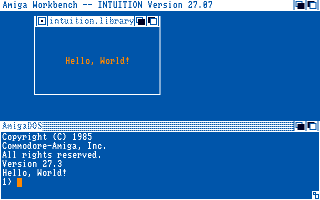

### Amiga 1.0 (NTSC)

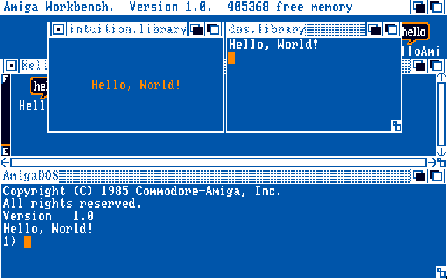

### Amiga 1.1 (NTSC)

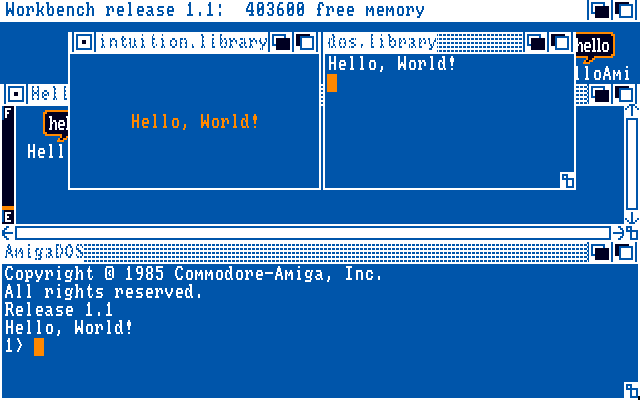

### Amiga 1.2

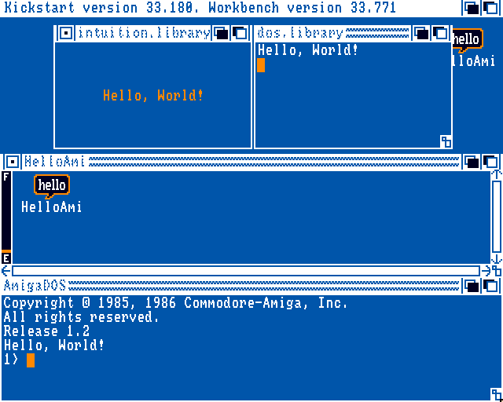

### Amiga 1.3

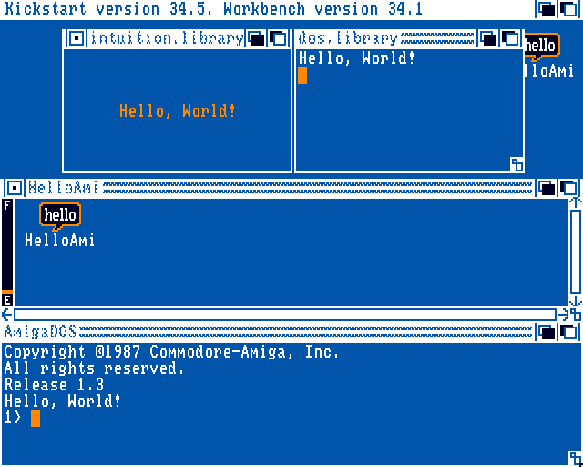

### Amiga 2.04  

### Amiga 2.05 (A600)

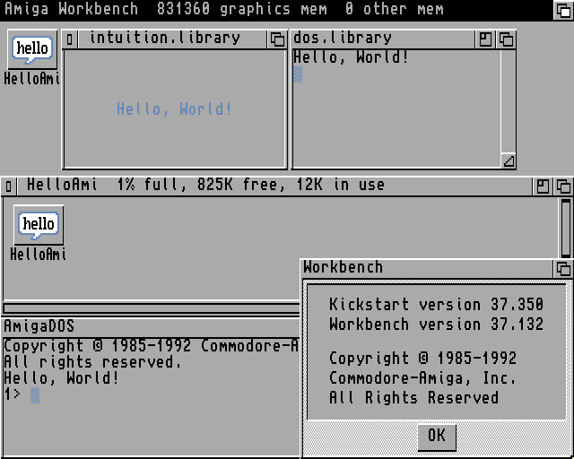

### Amiga 3.0 (A1200)

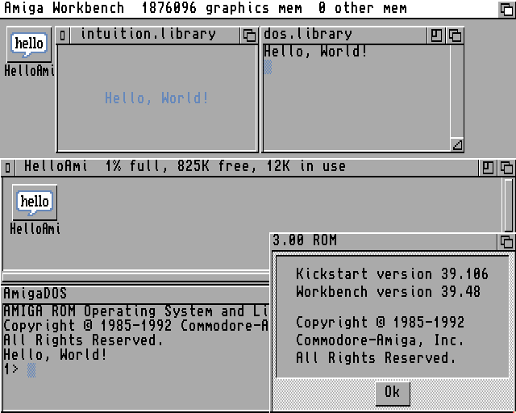

### Amiga 3.1 (A600)

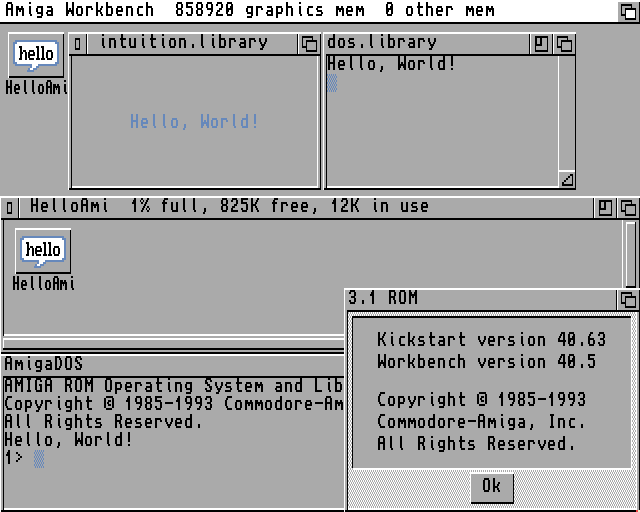

### Amiga 3.1 (A1200)

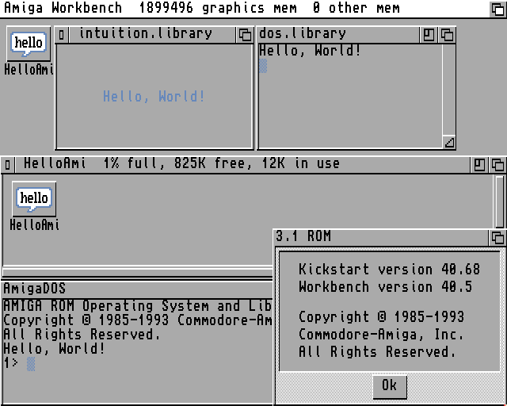

### Amiga 3.1 (A4000T)

- `Libs/workbench.library` 40.5 (24.5.93) added

[//]: # (HelloAmi-amiga-os-310-a4000t)
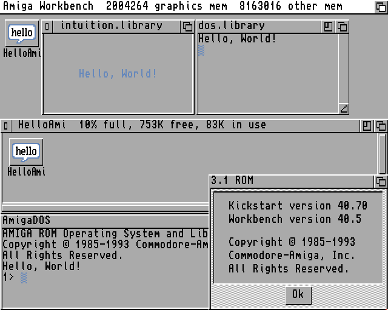

### Amiga 3.2 (beta)

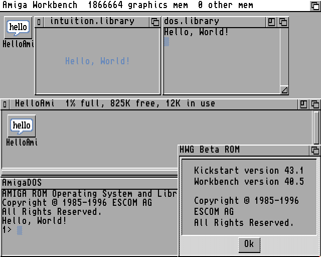

### AROS 20181209

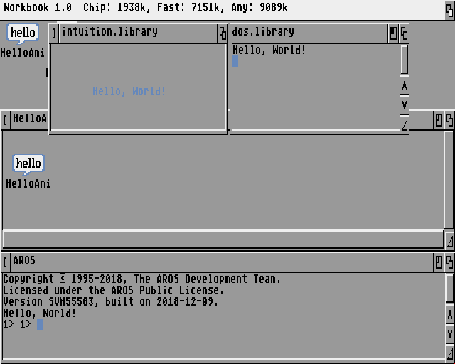

### Amiga 3.1.4 (A500)

- `C/LoadWB` 45.2 (3.5.2018) added
- `Libs/icon.library` 45.22 (24.9.2018) added
- `Libs/workbench.library` 45.194 (23.9.2018) added
- `S/Startup-Sequence` modified

[//]: # (HelloAmi-kick.a500.46.143)
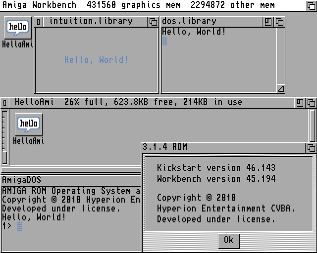

Aside
-----

You might build and use the [`BBlock0x.bb`](BBlock0x.bb.asm)
if an OFS floppy should be able to load DOS on 0.x beta ROMs.

Legal
-----

HelloAmi is free software and released under The MIT License (MIT).
