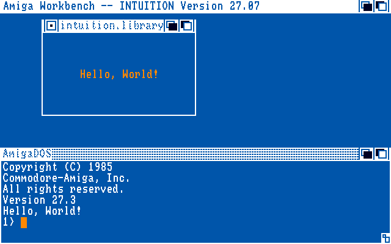
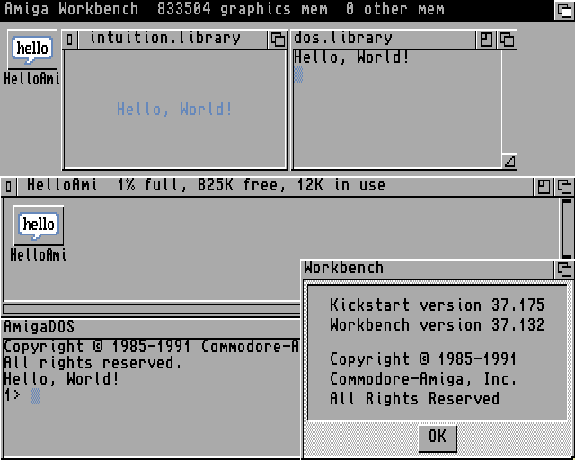
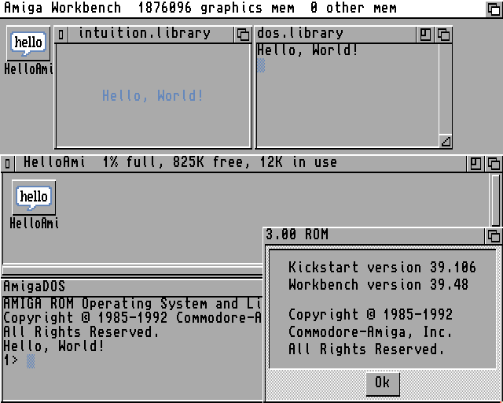
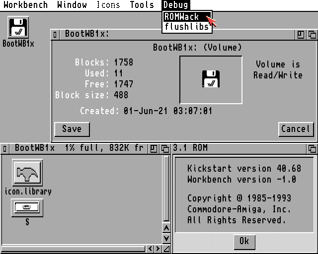
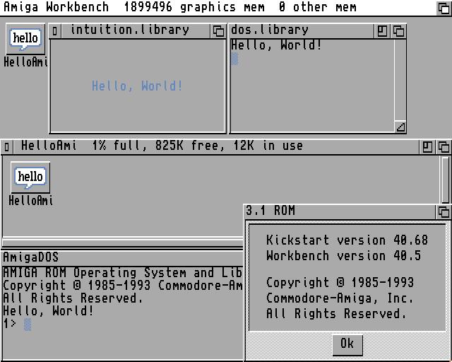
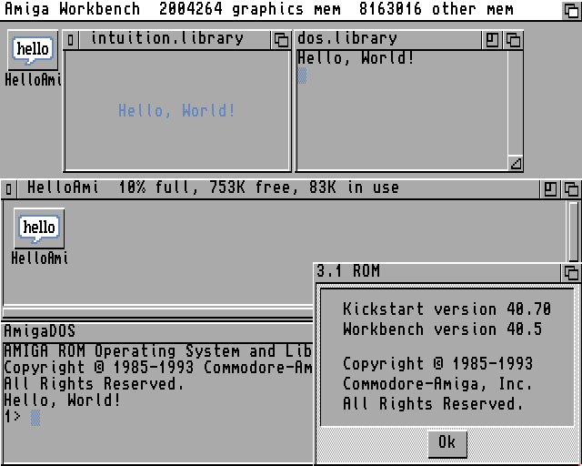
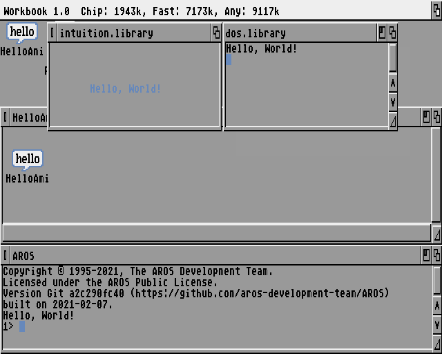

Test configurations for [FS-UAE](https://fs-uae.net/)
=====================================================

You have to import the referenced Kickstarts first, see
[Getting started](https://fs-uae.net/docs/getting-started).

Grabs
-----

### Amiga 0.7 (NTSC, Beta)

### Amiga 1.0 (NTSC)

  

### Amiga 1.1 (NTSC)

### Amiga 1.2

### Amiga 1.3

### Amiga 2.04  

### Amiga 2.05 (A600)

### Amiga 3.0 (A1200)

### Amiga 3.1 (A600)

### Amiga 3.1 (A1200)

  

### Amiga 3.1 (A4000T)

- `Libs/workbench.library` 40.5 (24.5.93) added

[//]: # (HelloAmi-amiga-os-310-a4000t)

### Amiga 3.2 (Walker)

### AROS (2021-02-07)

